# Assignment 1 - ReactJS app.

Name: Aaron Mooney

## Overview.
New / Modified features from the Movies App labs.
 
 + Create Login & Signup pages.
 + Change site header to accommodate new routes, change the tagline when a user is logged in and show a logout button while logged in.
 + Personalised views via user favorites and profile page.
 + Change favorite button functionality (ie. change from labs. Instead of removing the movie from the list, grey out the add to favorites button.).
 + Extend the app to accommodate TV Shows with a list view and show details view.
 + Extend the app to accommodate people in the film industry (Actors, crew etc.) with a list view and details view.
 + Protect the application by restricting routes to valid users.
 + Change the styling of the details view.
 + change the color scheme of the app.
 + Add tabs to the list view for movies and tv shows that the user can switch between to show a general list of movies, trending movies this week & upcoming movies.

## Setup requirements.

NPM - included with Node.JS, can be downloaded [here] (https://nodejs.org/en/download/)

Movies API Project **REQUIRED** , found [here] (https://github.com/AaronMooney/movies-api)

(Optional) Git, found [here] (https://git-scm.com/downloads) - if cloning this repo

Before starting the application run ```npm install``` to install any dependencies.

You can start the application by running ```npm start```

## Data Model Design.

### Additional TMDB Endpoints used

| TMDB Endpoint| Description|
| ---- |:--:|
| /trending/movie/week | Gets trending movies this week|
| /trending/tv/week	   | Gets trending tv shows this week|
| /movie/upcoming | Gets upcoming movies |
| /tv/popular | Gets popular tv shows|
| /tv/{id} | Get a tv show|
| /tv/{id}/reviews | Get a tv show's reviews|
| /person/popular/ | Gets popular people|
| /person/{id}/ | Gets a person| 

## App Design.

### Component catalogue.

 . . . . A screenshot showing the component stories from the Storybook UI. For expansion to the Movies app, hi-light stories relating to new/modified components.

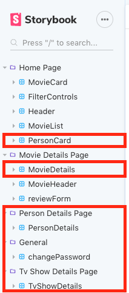

##### Person card
A card showing a person and their department & popularity

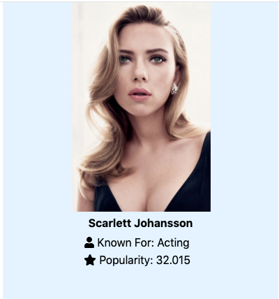

##### Movie Details View (Modified)

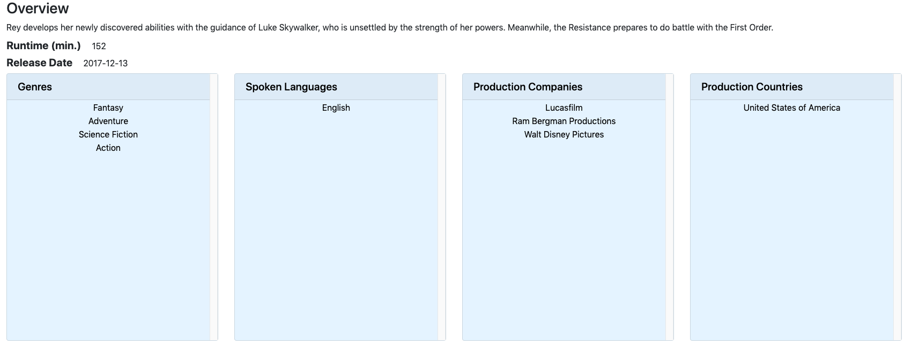

##### Tv Show Details View

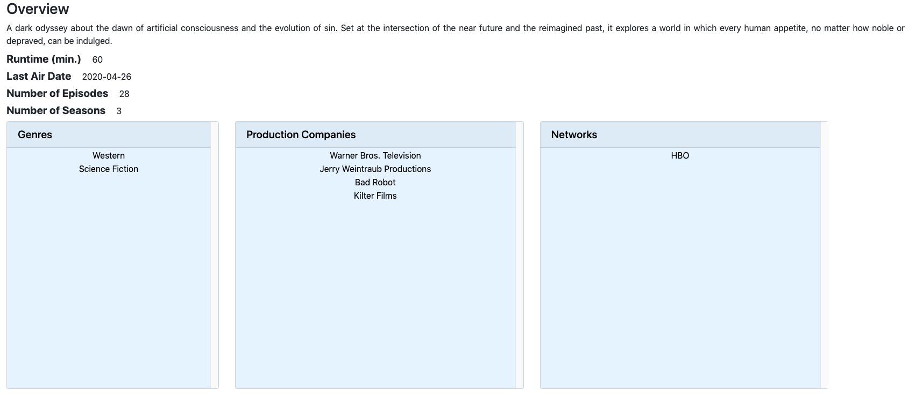

##### Person Details

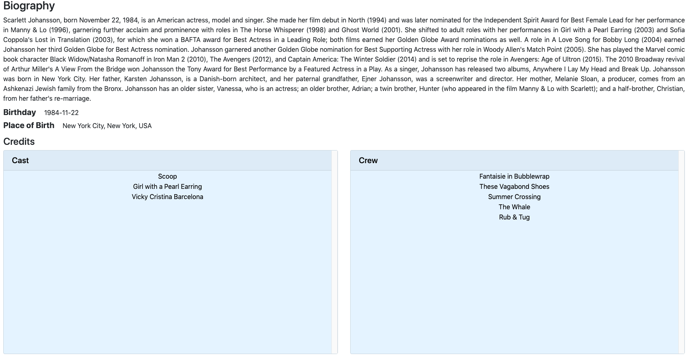

##### Change Password

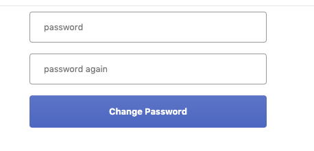

### Design patterns.

This app uses template pages similar to what was implemented in the labs for the new views.
For example, the tvShowDetailsPage uses a Page Template imported from templateTvShowPage which renders the children inside of the PageTemplate (in this case, the TvShowDetails component).

## UI Design.

New/Modified views

##### Movies Page
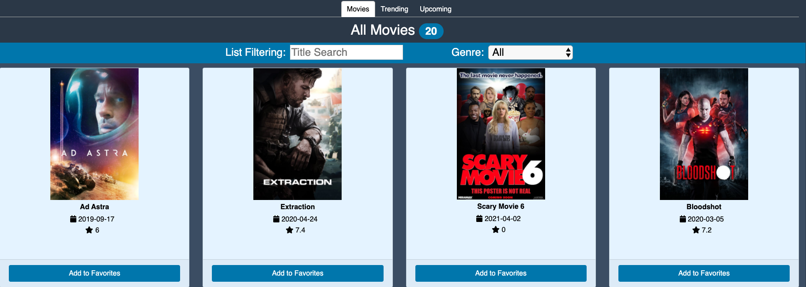
>I modified this page to include tabs at the top, these will switch between trending movies this week and upcoming movies.

##### Tv Shows Page
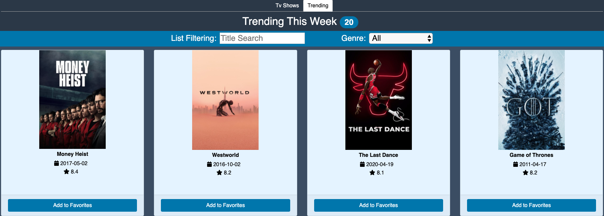
>Shows a list of TV shows, in this screenshot I have selected the trending tab so I am seeing what tv shows are trending this week.

##### Favorites Page
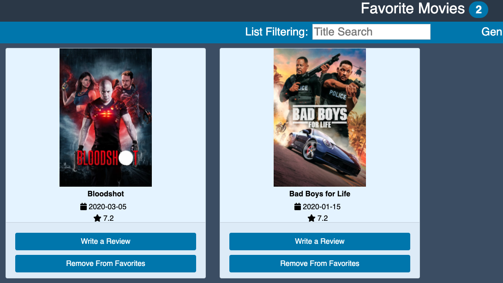
>I modified this page to include a remove from favorites button at the bottom of each card.

##### Site Header (not logged in)
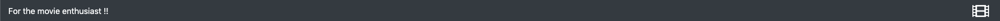
>The site header will show a basic tagline when not logged in.

##### Site Header (logged in)
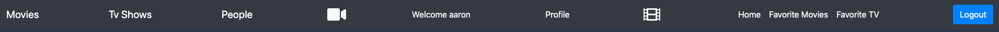
>The site header will show a personalised message, links to different pages and a logout button when logged in.

##### Profile / Account
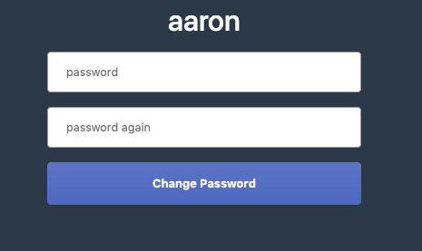
>This view shows the current user and gives the option to change password.

##### Favorited Item
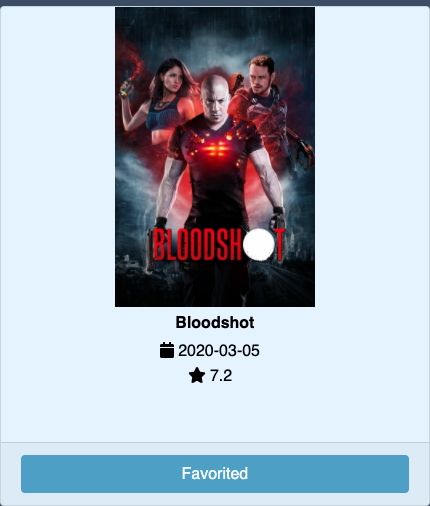
>When a movie or tv show is already favorited, the add to favorites button is disabled in the list and the text is changed to favorited.

##### Login Page
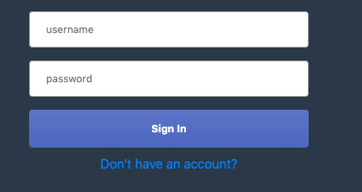
>This view serves as a login page.

##### Sign Up Page
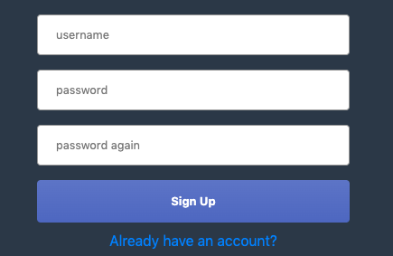
>This view serves as a registration page.

##### People Page
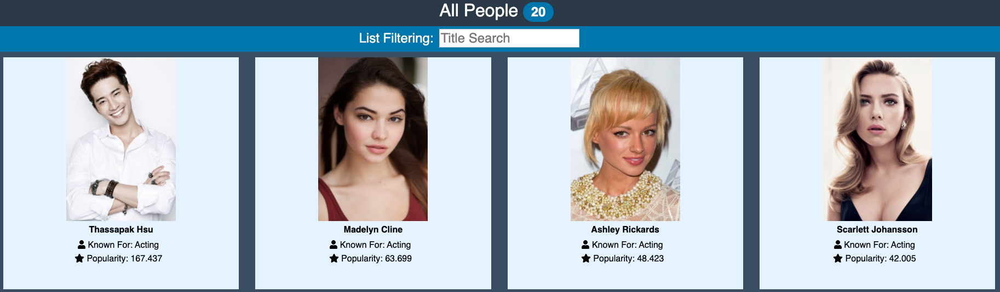
>This view shows a list of people associated with the movie industry, along with their profession and popularity

##### Person Details Page
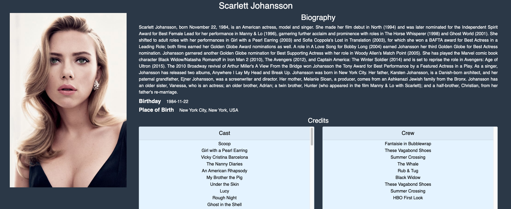
>This view shows more information about a specific person, including a biography, birthday, birthplace and credits as both cast and crew.

##### Movie Details Page
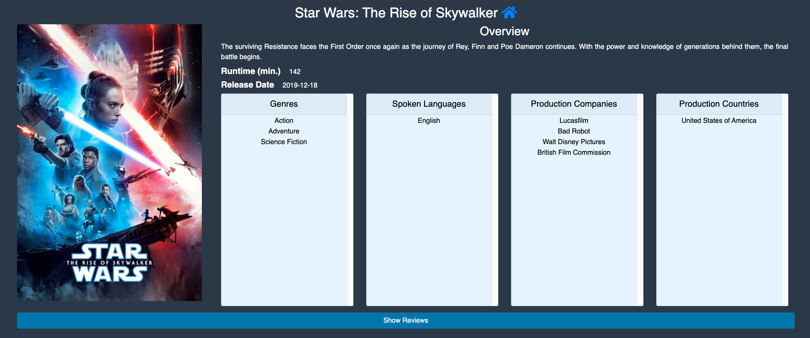
>I changed the styling of this page.

##### TV Show Details Page
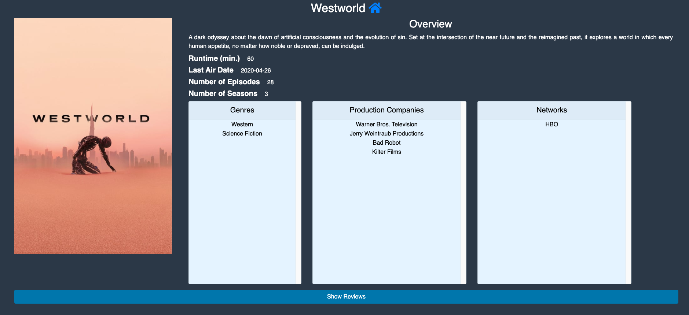
>This view shows extra information regarding a tv show such as, runtime, last air date, no. of episodes, no. of seasons, genres, production companies & networks.

## Routing.
. . . . List each route supported by your app and state the associated view. For expansion of the Movies Fan app, only new routes should be listed. Hi-light any advanced routing cases, e.g. nested routes. If relevant, specify which of the routes require authentication. . . . . . 

##### Private Routes
+ /movies - Homepage, unspecified routes are redirected here. - Shows Movie List Page.
+ /movies/:id - Shows the Movie Details Page
+ /movies/reviews/:id - Shows the Movie Review Page 
+ /movies/favorites - Shows the Favorite Movies Page
+ /movies/reviews/form - Shows the Add Movie Review Page
+ /tvShows/ - Shows the TV Shows Home Page
+ /tvShows/:id - Shows the Tv Show Details Page
+ /tvShows/reviews/:id - Shows the Tv Show Review Page
+ /tvShows/favorites/:id - Shows the Favorite Tv Shows Page
+ /people - Shows the People Home Page
+ /people/:id - Shows the Person Details Page

##### Public Routes
+ /login - Shows the Login Page
+ /signup - Shows the Sign Up Page


## Independent learning.

Before working on assignment 2, I implemented login functionality with google using [Auth0](https://auth0.com/blog/authenticating-your-first-react-app/#How-to-Use-the-Auth0-SPA-SDK-with-React) which I later removed in favor of the login functionality inside the API of assignment 2.


I also did some extra research on [bootstrap](https://getbootstrap.com/docs/3.4/css/) styling in order to change the styling of the details pages.

I did some research on styled components as they are used in one of the later labs to style the login page, and later used in the profile page to tell the user that they successfully updated their password.